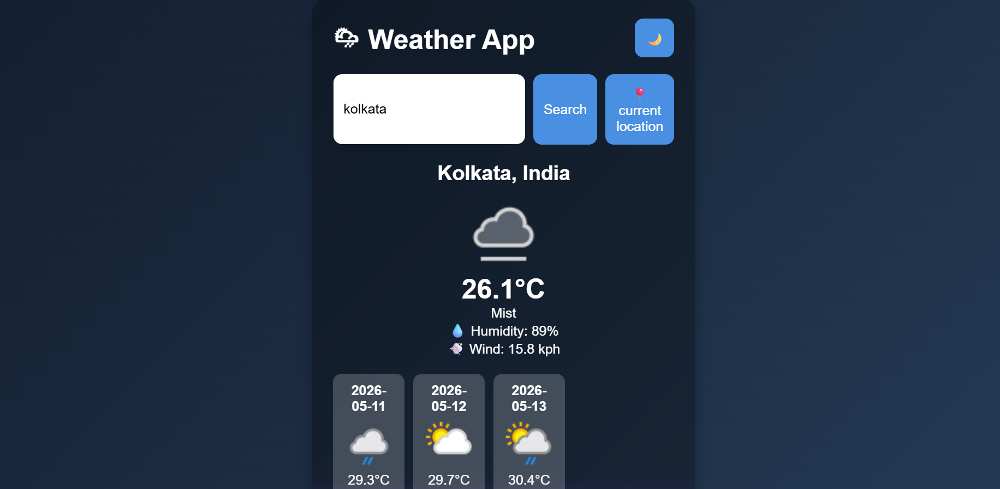

# Weather App 🌦️

A simple and responsive Weather Application that shows real-time weather information using a weather API.

## Features
- Search weather by city name
- Displays temperature, humidity, and weather condition
- Responsive user interface
- Real-time weather updates

## Technologies Used
- HTML
- CSS
- JavaScript
- Weather API

## Project Structure
```bash
├── index.html
├── style.css
├── script.js
└── whether-app.png
```

## Live Demo
 https://sreeparnabhowmick8.github.io/WHETHER-APP/

## How to Run
1. Download or clone the repository
2. Open `index.html` in your browser

## Screenshots


## Author
Sreeparna Bhowmick
